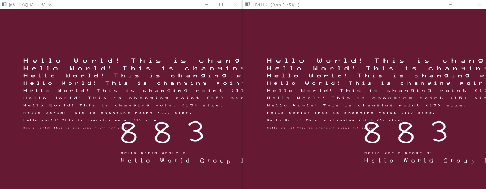
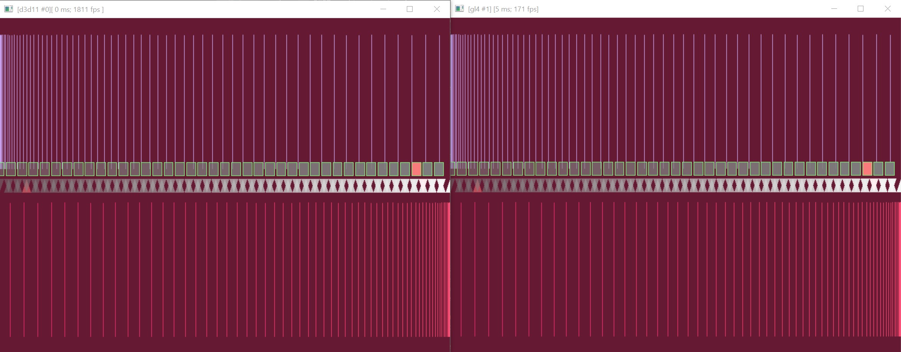
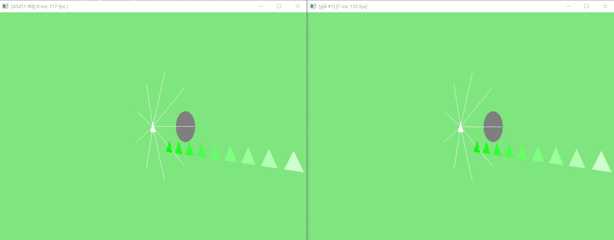
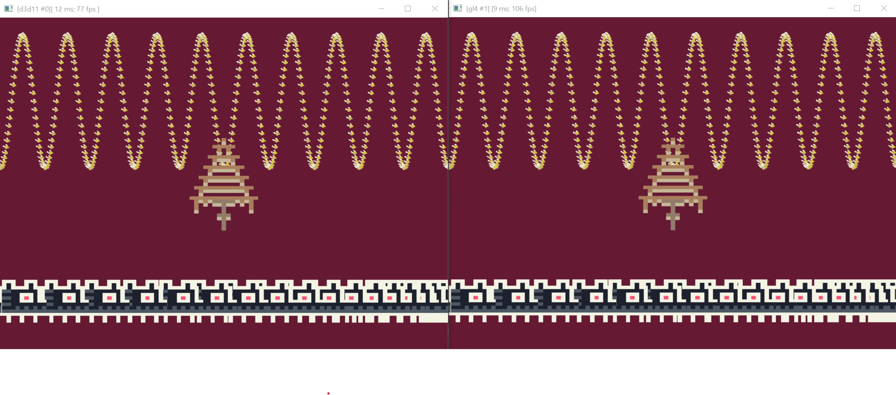
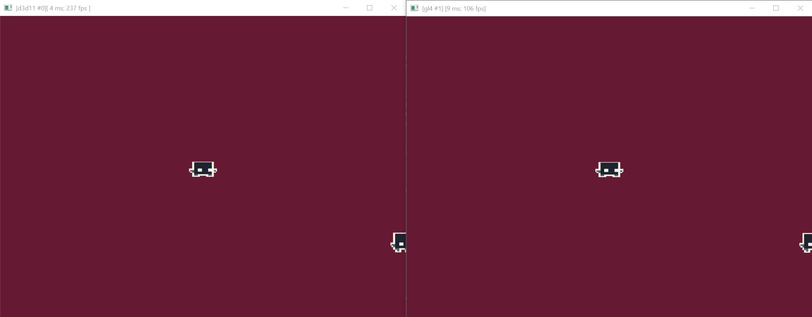
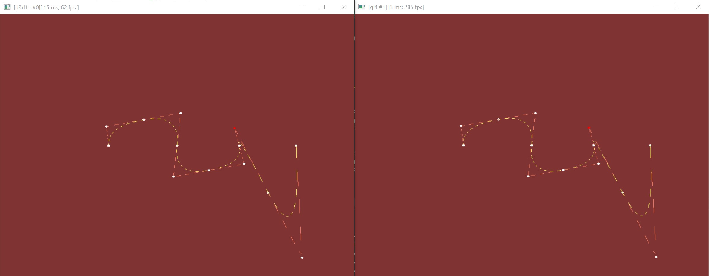
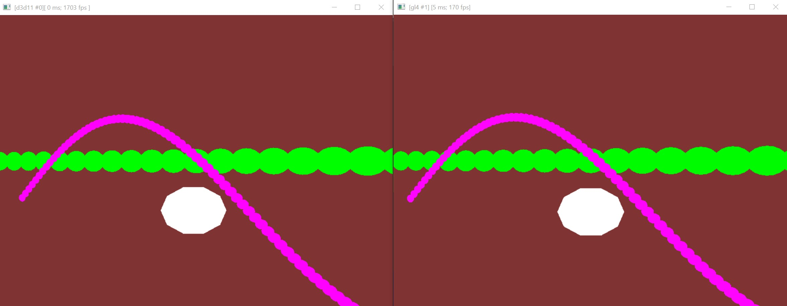

# suite gfx

## 00_text_renderer

Shows how to use the engines text renderer for 2d.

## 01_primitive_renderer_2d
Shows how to use the engines' primitive renderer 2d. Draws several primitives.

## 02_primitive_renderer_3d
Shows how to use the engines' primitive renderer 3d.

## 03_sprite_renderer
Shows how to use the engines' sprite renderer 2d.

## 04_sprite_sheet
Shows how to use the engines' sprite renderer 2d along with a motor engine sprite sheet.

## 05_spline_rendering_3d
Renders splines into 3d space.

## 06_keyframes_3d
Renders some primitives into 3d space and does keyframe animation.

