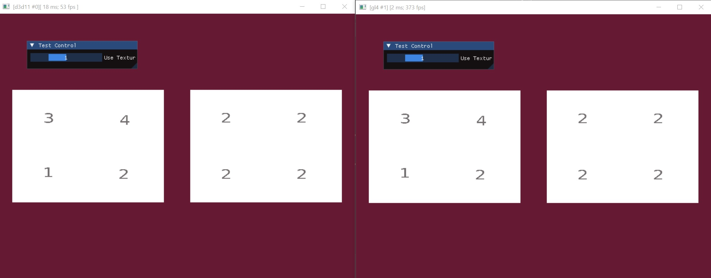
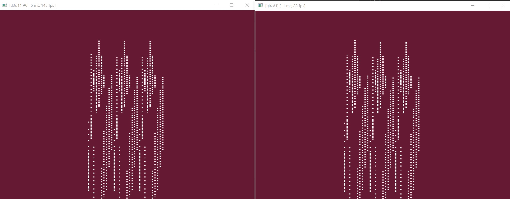
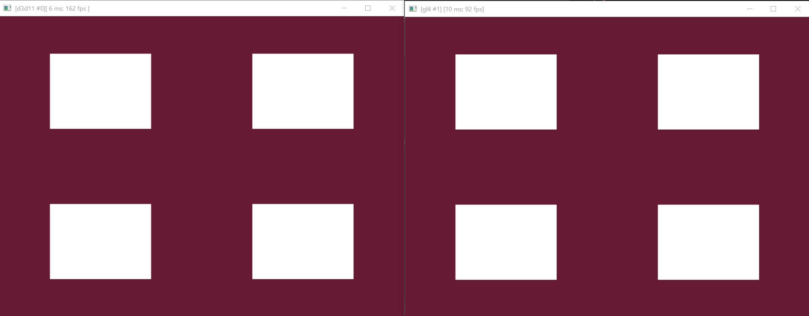

# suite graphics

## 01_simple_msl
Tests and shows framebuffer usage. Outputs two colors and allows to switch between the two render target outputs in post via the UI. Uses motor shaders.

## 02_framebuffer

Tests and shows framebuffer usage. Outputs two colors and allows to switch between the two render target outputs. Uses motor shaders.

## 03_multi_geometry

Test and shows how to use multiple geometry objects in a single render configuration. The geometry can be changed via a render call using an index. Important to note here is that the geometry can be arbitrary, but the geometry layout of any added geometry to the render objects needs to be the same. The images shows the test application rendering tow different geometry objects with differend vertex attributes like vertex positions and vertex color but uses the same vertex layout which is important.

## 04_framebuffer_mrt

Tests and shows how to use MRT and the framebuffer object. Displays all output at the same time in post. Uses motor shaders.

## 06_array_object

Tests and shows how to use an array object by doing the so called "vertex pulling" in the platform shader. Additional geometry data is pulled from an array buffer in the shader for further transformation. The shader pulls translation, rotation and color information from the array object. Array objects can be used to transfer alot of data to the GPU and decouple it from the geometry. So the geometry just needs to be present a few time or even only a single time but can be rendered many times by accessing the array object arbitrarilly in the shader.

## 08_texture_array

Tests and shows how to use a texture buffer. The app loads four images and allows access in the shaders through a texture array. The shaders are implemented as motor shaders. The UI allows to select an image in the array.

## 09_00_stream_out

Tests and shows how to use the streamout object in a GPU only simulation loop. This test does not use nsl shaders yet but platform shaders directy. The application uses the streamout object to transform geometry in a loop and afterwards binds it as a geometry object(vertex input data) for rendering. 

## 09_01_stream_out

This test performs a feedback loop using point primitives and binds the streamed out data to a data buffer object in the rendering shader which pulls the per vertex data from that data buffer which carries the streamout data.

## 09_02_stream_out

Performs the same test as the previous test but uses msl shaders. 

## 09_03_stream_out

Performs a streamout into a buffer object and feeds the data back to the particles vertex shader which performs a force integration in order to move the partilces. The only force applied is g(-9.81). The test uses nsl.

## 10_02_gs_generate

Generating quads in the geometry shader form points.

## 10_03_gs_streamout

This test performs a first filter streamout shader which uses a geometry shader for limiting the number of points streamed out to the buffer. In a second stage, another shader renders the number of streamed out points which are captured in the backend. The second shader does an additional geometry shader stage where the points are transformed to quads. The filter shader (kernel) also changes the scale of the points which are used in the render shaders' geometry shader for scaling the quads.

