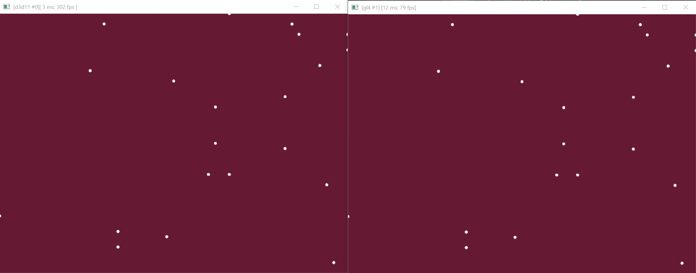
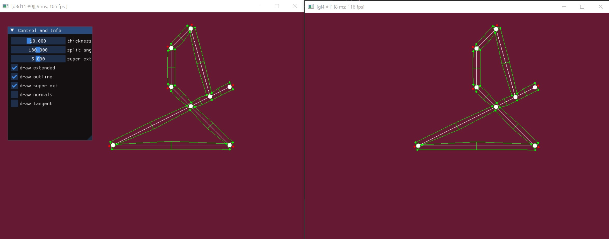

# suite gfx

## 00_world_2d

Testing a world grid renderer. Allows to move the camera with the mouse + right button.
There is an extend where the content is drawn. Additionally there is a preload extend 
that displays sd blue rects.

## 01_picking_2d

Picking circles with the mouse in 3d by projecting the mouse position onto a 2d plane.

## 02_branching_spline

Extracting some geometry from a linear connecting point network and producing thick lines. The idea was 
to produce some sort street like structure for top-down 2d car racing games.

The algorithm is not finished. For example, curved splines do not work or lines intersecting do not produce 
another intersection point.

